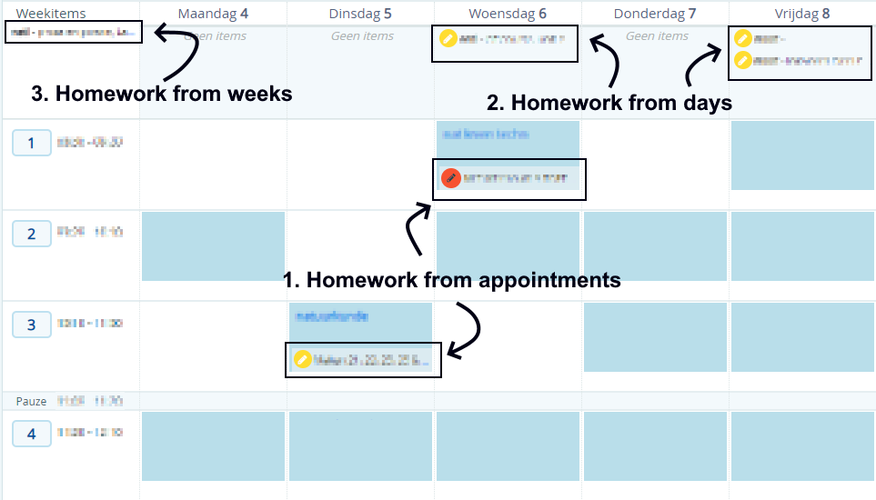

# SOMtoday Homework docs

---

## Table of contents

<!-- TOC -->

- [SOMtoday Homework docs](#somtoday-rest-api-docs)
  - [Table of contents](#table-of-contents)
  - [General Info](#general-info)
  - [Fetching Information](#fetching-homework)
    - [1. Homework from appointments: `GET /rest/v1/studiewijzeritemafspraaktoekenningen`](#1-homework-from-appointments-get-restv1studiewijzeritemafspraaktoekenningen)
      - [Parameters](#parameters)
      - [Returns](#returns)
    - [2. Homework from days: `GET /rest/v1/studiewijzeritemdagtoekenningen`](#2-homework-from-days-get-restv1studiewijzeritemdagtoekenningen)
      - [Parameters](#parameters-1)
      - [Returns](#returns-1)
    - [3. Homework from weeks: `GET /rest/v1/studiewijzeritemweektoekenningen`](#3-homework-from-weeks-get-restv1studiewijzeritemweektoekenningen)
      - [Parameters](#parameters-2)
      - [Returns](#returns-2)
  - [Updating Information](#updating-information)
    - [1. Homework Made `PUT /rest/v1/swigemaakt/[id]`](#1-homework-made-put-restv1swigemaaktid)
      - [Parameters](#parameters-3)
      - [Body](#body)
      - [Returns](#returns-3)}

<!-- /TOC -->

---

## General Info

There are 3 different types of homework in Somtoday. In picture below you can see how they look on the website.
For each kind of homework you can request a specific homework item by adding `/[id]` behind it, with the id from `links[0].id`. You could also use the link from `links[0].href`



## Fetching Homework

### 1. Homework from appointments: `GET /rest/v1/studiewijzeritemafspraaktoekenningen`

Receives the homework from appointments after a specified date

#### Parameters

| Name          | Type      | Value                 |
| ------------- | --------- | --------------------- |
| begintNaOfOp  | Parameter | Date (yyyy-MM-dd)     |
| additional    | Paramater | swigemaaktVinkjes     |
| additional    | Paramater | leerlingen            |
| additional    | Paramater | huiswerkgemaakt       |
| Authorization | Header    | Bearer [access_token] |

#### Returns

```json
{
  "items": [
    {
      "$type": "studiewijzer.RSWIAfspraakToekenning",
      "links": [
        {
          "id": 12345678901,
          "rel": "self",
          "type": "studiewijzer.RSWIAfspraakToekenning",
          "href": "{{api_url}}/rest/v1/studiewijzeritemafspraaktoekenningen/12345678901"
        }
      ],
      "permissions": [],
      "additionalObjects": {
        "huiswerkgemaakt": null,
        "swigemaaktVinkjes": {
          "$type": "LinkableWrapper",
          "items": [
            {
              "$type": "studiewijzer.RSWIGemaakt",
              "links": [
                {
                  "id": 1234567890123,
                  "rel": "self",
                  "type": "studiewijzer.RSWIGemaakt",
                  "href": "{{api_url}}/rest/v1/swigemaakt/1234567890123"
                }
              ],
              "permissions": [],
              "additionalObjects": {},
              "leerling": {
                "links": [
                  {
                    "id": 1234567890,
                    "rel": "self",
                    "type": "leerling.RLeerlingPrimer",
                    "href": "https://api.somtoday.nl/rest/v1/leerlingen/1234567890"
                  }
                ],
                "permissions": [],
                "additionalObjects": {},
                "UUID": "12abc34-12a3-1a2b-a1b2-1a2b34cd5e67",
                "leerlingnummer": 10000,
                "roepnaam": "NAME",
                "achternaam": "NAME"
              },
              "swiToekenning": {
                "links": [
                  {
                    "id": 1234567890123,
                    "rel": "koppeling",
                    "type": "studiewijzer.RSWIToekenning"
                  }
                ],
                "permissions": [],
                "additionalObjects": {},
                "studiewijzer": {
                  "links": [
                    {
                      "id": 12345678901,
                      "rel": "koppeling",
                      "type": "studiewijzer.RAbstractStudiewijzer"
                    }
                  ],
                  "permissions": [],
                  "additionalObjects": {},
                  "uuid": "12abc34e-12a3-1a2b-a1b2-1a2b34cd5e67",
                  "naam": "engels, leerjaar 6",
                  "vestiging": {
                    "links": [
                      {
                        "id": 1234567890,
                        "rel": "self",
                        "type": "instelling.RVestiging",
                        "href": "{{api_url}}/rest/v1/vestigingen/1234567890"
                      }
                    ],
                    "permissions": [],
                    "additionalObjects": {},
                    "naam": "School Name"
                  }
                },
                "studiewijzerItem": {
                  "links": [
                    {
                      "id": 1234567890123,
                      "rel": "self",
                      "type": "studiewijzer.RStudiewijzerItem",
                      "href": "{{api_url}}/rest/v1/studiewijzeritems/1234567890123"
                    }
                  ],
                  "permissions": [],
                  "additionalObjects": {},
                  "onderwerp": "Topic",
                  "huiswerkType": "GROTE_TOETS, TOETS or HUISWERK",
                  "omschrijving": "Description",
                  "inleverperiodes": false,
                  "lesmateriaal": false,
                  "projectgroepen": false,
                  "bijlagen": [],
                  "externeMaterialen": [],
                  "inlevermomenten": [],
                  "tonen": true,
                  "notitieZichtbaarVoorLeerling": false
                },
                "sortering": 0,
                "synchroniseertMet": "Leerjaar 6, periode 2"
              },
              "gemaakt": true
            }
          ]
        },
        "leerlingen": {
          "$type": "LinkableWrapper",
          "items": [
            {
              "$type": "leerling.RLeerlingPrimer",
              "links": [
                {
                  "id": 12345678901,
                  "rel": "self",
                  "type": "leerling.RLeerlingPrimer",
                  "href": "{{api_url}}/rest/v1/leerlingen/12345678901"
                }
              ],
              "permissions": [],
              "additionalObjects": {},
              "UUID": "12abc34e-12a3-1a2b-a1b2-1a2b34cd5e67",
              "leerlingnummer": 10000,
              "roepnaam": "NAME",
              "achternaam": "NAME"
            }
          ]
        }
      },
      "studiewijzer": {
        "links": [
          {
            "id": 12345678901,
            "rel": "koppeling",
            "type": "studiewijzer.RAbstractStudiewijzer"
          }
        ],
        "permissions": [],
        "additionalObjects": {},
        "uuid": "12abc34-12a3-1a2b-a1b2-1a2b34cd5e67",
        "naam": "6entl4",
        "vestiging": {
          "links": [
            {
              "id": 12345678901,
              "rel": "self",
              "type": "instelling.RVestiging",
              "href": "{{api_url}}/rest/v1/vestigingen/12345678901"
            }
          ],
          "permissions": [],
          "additionalObjects": {},
          "naam": "SchoolName"
        }
      },
      "studiewijzerItem": {
        "links": [
          {
            "id": 12345678901,
            "rel": "self",
            "type": "studiewijzer.RStudiewijzerItem",
            "href": "{{api_url}}/rest/v1/studiewijzeritems/12345678901"
          }
        ],
        "permissions": [],
        "additionalObjects": {},
        "onderwerp": "Topic",
        "huiswerkType": "GROTE_TOETS, TOETS or HUISWERK",
        "omschrijving": "Description",
        "inleverperiodes": false,
        "lesmateriaal": false,
        "projectgroepen": false,
        "bijlagen": [],
        "externeMaterialen": [],
        "inlevermomenten": [],
        "tonen": true,
        "notitieZichtbaarVoorLeerling": false
      },
      "sortering": 0,
      "lesgroep": {
        "links": [
          {
            "id": 12345678901,
            "rel": "self",
            "type": "lesgroep.RLesgroep",
            "href": "{{api_url}}/rest/v1/lesgroepen/12345678901"
          }
        ],
        "permissions": [],
        "additionalObjects": {},
        "UUID": "12abc34-12a3-1a2b-a1b2-1a2b34cd5e67",
        "naam": "6entl4",
        "schooljaar": {
          "$type": "onderwijsinrichting.RSchooljaar",
          "links": [
            {
              "id": 12345678,
              "rel": "self",
              "type": "onderwijsinrichting.RSchooljaar",
              "href": "{{api_url}}/rest/v1/schooljaren/12345678"
            }
          ],
          "permissions": [],
          "additionalObjects": {},
          "naam": "2020/2021",
          "vanafDatum": "2020-08-01",
          "totDatum": "2021-07-31",
          "isHuidig": true
        },
        "vak": {
          "links": [
            {
              "id": 12345678901,
              "rel": "self",
              "type": "onderwijsinrichting.RVak",
              "href": "{{api_url}}/rest/v1/vakken/12345678901"
            }
          ],
          "permissions": [],
          "additionalObjects": {},
          "afkorting": "entl",
          "naam": "Engelse taal en literatuur"
        },
        "heeftStamgroep": true,
        "examendossierOndersteund": true
      },
      "datumTijd": "yyyy-MM-dd'T'HH:mm:ss.SSS+HH:mm",
      "aangemaaktOpDatumTijd": "yyyy-MM-dd'T'HH:mm:ss.SSS+HH:mm"
    }
  ]
}
```

---

### 2. Homework from days: `GET /rest/v1/studiewijzeritemdagtoekenningen`

Receives the homework from days after a specified date.

#### Parameters

| Name          | Type      | Value                 |
| ------------- | --------- | --------------------- |
| begintNaOfOp  | Parameter | Date (yyyy-MM-dd)     |
| additional    | Parameter | swigemaaktVinkjes     |
| additional    | Parameter | leerlingen            |
| Authorization | Header    | Bearer [access_token] |

#### Returns

```json
{
  "items": [
    {
      "$type": "studiewijzer.RSWIDagToekenning",
      "links": [
        {
          "id": 123456789012,
          "rel": "self",
          "type": "studiewijzer.RSWIDagToekenning",
          "href": "https://api.somtoday.nl/rest/v1/studiewijzeritemdagtoekenningen/123456789012"
        }
      ],
      "permissions": [],
      "additionalObjects": {
        "swigemaaktVinkjes": {
          "$type": "LinkableWrapper",
          "items": [
            {
              "$type": "studiewijzer.RSWIGemaakt",
              "links": [
                {
                  "id": 123456789012,
                  "rel": "self",
                  "type": "studiewijzer.RSWIGemaakt",
                  "href": "{{api_url}}/rest/v1/swigemaakt/123456789012"
                }
              ],
              "permissions": [],
              "additionalObjects": {},
              "leerling": {
                "links": [
                  {
                    "id": 1234567890,
                    "rel": "self",
                    "type": "leerling.RLeerlingPrimer",
                    "href": "{{api_url}}/rest/v1/leerlingen/1234567890"
                  }
                ],
                "permissions": [],
                "additionalObjects": {},
                "UUID": "12abc34-12a3-1a2b-a1b2-1a2b34cd5e67",
                "leerlingnummer": 100000,
                "roepnaam": "Name",
                "achternaam": "Name"
              },
              "swiToekenning": {
                "links": [
                  {
                    "id": 123456789012,
                    "rel": "koppeling",
                    "type": "studiewijzer.RSWIToekenning"
                  }
                ],
                "permissions": [],
                "additionalObjects": {},
                "studiewijzer": {
                  "links": [
                    {
                      "id": 12345678901,
                      "rel": "koppeling",
                      "type": "studiewijzer.RAbstractStudiewijzer"
                    }
                  ],
                  "permissions": [],
                  "additionalObjects": {},
                  "uuid": "12abc34-12a3-1a2b-a1b2-1a2b34cd5e67",
                  "naam": "6entl4",
                  "vestiging": {
                    "links": [
                      {
                        "id": 1234567890,
                        "rel": "self",
                        "type": "instelling.RVestiging",
                        "href": "{{api_url}}/rest/v1/vestigingen/1234567890"
                      }
                    ],
                    "permissions": [],
                    "additionalObjects": {},
                    "naam": "School Name"
                  }
                },
                "studiewijzerItem": {
                  "links": [
                    {
                      "id": 123456789012,
                      "rel": "self",
                      "type": "studiewijzer.RStudiewijzerItem",
                      "href": "{{api_url}}/rest/v1/studiewijzeritems/123456789012"
                    }
                  ],
                  "permissions": [],
                  "additionalObjects": {},
                  "onderwerp": "Topic",
                  "huiswerkType": "GROTE_TOETS, TOETS or HUISWERK",
                  "omschrijving": "Description",
                  "inleverperiodes": false,
                  "lesmateriaal": false,
                  "projectgroepen": false,
                  "bijlagen": [],
                  "externeMaterialen": [],
                  "inlevermomenten": [],
                  "tonen": true,
                  "notitieZichtbaarVoorLeerling": false
                },
                "sortering": 0
              },
              "gemaakt": true
            }
          ]
        },
        "leerlingen": {
          "$type": "LinkableWrapper",
          "items": [
            {
              "$type": "leerling.RLeerlingPrimer",
              "links": [
                {
                  "id": 1234567890,
                  "rel": "self",
                  "type": "leerling.RLeerlingPrimer",
                  "href": "{{api_url}}/rest/v1/leerlingen/1234567890"
                }
              ],
              "permissions": [],
              "additionalObjects": {},
              "UUID": "12abc34-12a3-1a2b-a1b2-1a2b34cd5e67",
              "leerlingnummer": 100000,
              "roepnaam": "Name",
              "achternaam": "Name"
            }
          ]
        }
      },
      "studiewijzer": {
        "links": [
          {
            "id": 12345678901,
            "rel": "koppeling",
            "type": "studiewijzer.RAbstractStudiewijzer"
          }
        ],
        "permissions": [],
        "additionalObjects": {},
        "uuid": "12abc34-12a3-1a2b-a1b2-1a2b34cd5e67",
        "naam": "6entl4",
        "vestiging": {
          "links": [
            {
              "id": 1234567890,
              "rel": "self",
              "type": "instelling.RVestiging",
              "href": "{{api_url}}/rest/v1/vestigingen/1234567890"
            }
          ],
          "permissions": [],
          "additionalObjects": {},
          "naam": "School Name"
        }
      },
      "studiewijzerItem": {
        "links": [
          {
            "id": 123456789012,
            "rel": "self",
            "type": "studiewijzer.RStudiewijzerItem",
            "href": "{{api_url}}/rest/v1/studiewijzeritems/123456789012"
          }
        ],
        "permissions": [],
        "additionalObjects": {},
        "onderwerp": "Topic",
        "huiswerkType": "GROTE_TOETS, TOETS or HUISWERK",
        "omschrijving": "Description",
        "inleverperiodes": false,
        "lesmateriaal": false,
        "projectgroepen": false,
        "bijlagen": [],
        "externeMaterialen": [],
        "inlevermomenten": [],
        "tonen": true,
        "notitieZichtbaarVoorLeerling": false
      },
      "sortering": 0,
      "datumTijd": "2020-10-08T00:00:00.000+02:00",
      "lesgroep": {
        "links": [
          {
            "id": 12345678901,
            "rel": "self",
            "type": "lesgroep.RLesgroep",
            "href": "{{api_url}}/rest/v1/lesgroepen/12345678901"
          }
        ],
        "permissions": [],
        "additionalObjects": {},
        "UUID": "12abc34e-12a3-1a2b-a1b2-1a2b34cd5e67",
        "naam": "6entl4",
        "schooljaar": {
          "$type": "onderwijsinrichting.RSchooljaar",
          "links": [
            {
              "id": 12345678,
              "rel": "self",
              "type": "onderwijsinrichting.RSchooljaar",
              "href": "{{api_url}}/rest/v1/schooljaren/12345678"
            }
          ],
          "permissions": [],
          "additionalObjects": {},
          "naam": "2020/2021",
          "vanafDatum": "2020-08-01",
          "totDatum": "2021-07-31",
          "isHuidig": true
        },
        "vak": {
          "links": [
            {
              "id": 1234567890,
              "rel": "self",
              "type": "onderwijsinrichting.RVak",
              "href": "{{api_url}}/rest/v1/vakken/1234567890"
            }
          ],
          "permissions": [],
          "additionalObjects": {},
          "afkorting": "entl",
          "naam": "engelse taal en literatuur"
        },
        "heeftStamgroep": true,
        "examendossierOndersteund": true
      }
    }
  ]
}
```

---

### 3. Homework from weeks: `GET /rest/v1/studiewijzeritemweektoekenningen`

Receives the homework from weeks after a specified date.

#### Parameters

| Name          | Type      | Value                 |
| ------------- | --------- | --------------------- |
| begintNaOfOp  | Parameter | Date (yyyy-MM-dd)     |
| schooljaar    | Parameter | School Year ID        |
| weeknummer    | Parameter | [number]              |
| weeknummer    | Parameter | etc..                 |
| additional    | Parameter | swigemaaktVinkjes     |
| additional    | Parameter | leerlingen            |
| Authorization | Header    | Bearer [access_token] |

#### Returns

```json
{
  "items": [
    {
      "$type": "studiewijzer.RSWIWeekToekenning",
      "links": [
        {
          "id": 12345678901,
          "rel": "self",
          "type": "studiewijzer.RSWIWeekToekenning",
          "href": "{{api_url}}/rest/v1/studiewijzeritemweektoekenningen/12345678901"
        }
      ],
      "permissions": [],
      "additionalObjects": {
        "swigemaaktVinkjes": {
          "$type": "LinkableWrapper",
          "items": [
            {
              "$type": "studiewijzer.RSWIGemaakt",
              "links": [
                {
                  "id": 123456789012,
                  "rel": "self",
                  "type": "studiewijzer.RSWIGemaakt",
                  "href": "{{api_url}}/rest/v1/swigemaakt/123456789012"
                }
              ],
              "permissions": [],
              "additionalObjects": {},
              "leerling": {
                "links": [
                  {
                    "id": 1234567890,
                    "rel": "self",
                    "type": "leerling.RLeerlingPrimer",
                    "href": "{{api_url}}/rest/v1/leerlingen/1234567890"
                  }
                ],
                "permissions": [],
                "additionalObjects": {},
                "UUID": "12abc34e-12a3-1a2b-a1b2-1a2b34cd5e67",
                "leerlingnummer": 100000,
                "roepnaam": "Name",
                "achternaam": "Name"
              },
              "swiToekenning": {
                "links": [
                  {
                    "id": 12345678901,
                    "rel": "koppeling",
                    "type": "studiewijzer.RSWIToekenning"
                  }
                ],
                "permissions": [],
                "additionalObjects": {},
                "studiewijzer": {
                  "links": [
                    {
                      "id": 12345678901,
                      "rel": "koppeling",
                      "type": "studiewijzer.RAbstractStudiewijzer"
                    }
                  ],
                  "permissions": [],
                  "additionalObjects": {},
                  "uuid": "12abc34e-12a3-1a2b-a1b2-1a2b34cd5e67",
                  "naam": "Klas 6entl4",
                  "vestiging": {
                    "links": [
                      {
                        "id": 1234567890,
                        "rel": "self",
                        "type": "instelling.RVestiging",
                        "href": "{{api_url}}/rest/v1/vestigingen/1234567890"
                      }
                    ],
                    "permissions": [],
                    "additionalObjects": {},
                    "naam": "School Name"
                  }
                },
                "studiewijzerItem": {
                  "links": [
                    {
                      "id": 12345678901,
                      "rel": "self",
                      "type": "studiewijzer.RStudiewijzerItem",
                      "href": "{{api_url}}/rest/v1/studiewijzeritems/12345678901"
                    }
                  ],
                  "permissions": [],
                  "additionalObjects": {},
                  "onderwerp": "Topic",
                  "huiswerkType": "GROTE_TOETS, TOETS or HUISWERK",
                  "omschrijving": "Description",
                  "inleverperiodes": false,
                  "lesmateriaal": false,
                  "projectgroepen": false,
                  "bijlagen": [],
                  "externeMaterialen": [],
                  "inlevermomenten": [],
                  "tonen": true,
                  "notitieZichtbaarVoorLeerling": false
                },
                "sortering": 1,
                "synchroniseertMet": "Engels klas 6 periode 4"
              },
              "gemaakt": true
            }
          ]
        },
        "leerlingen": {
          "$type": "LinkableWrapper",
          "items": [
            {
              "$type": "leerling.RLeerlingPrimer",
              "links": [
                {
                  "id": 1234567890,
                  "rel": "self",
                  "type": "leerling.RLeerlingPrimer",
                  "href": "{{api_url}}/rest/v1/leerlingen/1234567890"
                }
              ],
              "permissions": [],
              "additionalObjects": {},
              "UUID": "12abc34e-12a3-1a2b-a1b2-1a2b34cd5e67",
              "leerlingnummer": 100000,
              "roepnaam": "Name",
              "achternaam": "Name"
            }
          ]
        }
      },
      "studiewijzer": {
        "links": [
          {
            "id": 12345678901,
            "rel": "koppeling",
            "type": "studiewijzer.RAbstractStudiewijzer"
          }
        ],
        "permissions": [],
        "additionalObjects": {},
        "uuid": "12abc34e-12a3-1a2b-a1b2-1a2b34cd5e67",
        "naam": "Klas 6entl4",
        "vestiging": {
          "links": [
            {
              "id": 1234567890,
              "rel": "self",
              "type": "instelling.RVestiging",
              "href": "{{api_url}}/rest/v1/vestigingen/1234567890"
            }
          ],
          "permissions": [],
          "additionalObjects": {},
          "naam": "School Name"
        }
      },
      "studiewijzerItem": {
        "links": [
          {
            "id": 12345678901,
            "rel": "self",
            "type": "studiewijzer.RStudiewijzerItem",
            "href": "{{api_url}}/rest/v1/studiewijzeritems/12345678901"
          }
        ],
        "permissions": [],
        "additionalObjects": {},
        "onderwerp": "Topic",
        "huiswerkType": "GROTE_TOETS, TOETS or HUISWERK",
        "omschrijving": "Description",
        "inleverperiodes": false,
        "lesmateriaal": false,
        "projectgroepen": false,
        "bijlagen": [],
        "externeMaterialen": [],
        "inlevermomenten": [],
        "tonen": true,
        "notitieZichtbaarVoorLeerling": false
      },
      "sortering": 1,
      "synchroniseertMet": "Wiskunde klas 6 periode 4",
      "weeknummerVanaf": 60,
      "weeknummerTm": 60
    }
  ]
}
```

---

## Updating information

### 1. Homework Made `PUT /rest/v1/swigemaakt/[id]`

Updates the the `gemaakt` status of a `studiewijzer.RSWIGemaakt` object

#### Parameters

| Name          | Type   | Value                 |
| ------------- | ------ | --------------------- |
| Authorization | Header | Bearer [access_token] |

#### Body

This is the minimal information you need to update the `gemaakt` status, you can get all the information from every kind of homework listed above.

```json
{
  "leerling": {
    "links": [
      {
        "id": 1234567890,
        "rel": "self",
        "href": "https://api.somtoday.nl/rest/v1/leerlingen/1234567890"
      }
    ]
  },
  "gemaakt": true
}
```

#### Returns

The now changed `studiewijzer.RSWIGemaakt` Object

```json
{
  "links": [
    {
      "id": 1234567890123,
      "rel": "self",
      "type": "studiewijzer.RSWIGemaakt",
      "href": "{{api_url}}/rest/v1/swigemaakt/1234567890123"
    }
  ],
  "permissions": [
    {
      "full": "studiewijzer.RSWIGemaakt:READ,UPDATE:INSTANCE(1234567890123)",
      "type": "studiewijzer.RSWIGemaakt",
      "operations": [
        "READ",
        "UPDATE"
      ],
      "instances": [
        "INSTANCE(1234567890123)"
      ]
    }
  ],
  "additionalObjects": {},
  "leerling": {
    "links": [
      {
        "id": 1234567890,
        "rel": "self",
        "type": "leerling.RLeerlingPrimer",
        "href": "{{api_url}}/rest/v1/leerlingen/1234567890"
      }
    ],
    "permissions": [
      {
        "full": "leerling.RLeerlingPrimer:READ:INSTANCE(1234567890)",
        "type": "leerling.RLeerlingPrimer",
        "operations": [
          "READ"
        ],
        "instances": [
          "INSTANCE(1234567890)"
        ]
      }
    ],
    "additionalObjects": {},
    "UUID": "xxxxxxxx-xxxx-xxxx-xxxx-xxxxxxxxxxxx",
    "leerlingnummer": 100000,
    "roepnaam": "Name",
    "voorvoegsel": "Name",
    "achternaam": "Name"
  },
  "swiToekenningId": 1234567890123,
  "gemaakt": true
}
```


